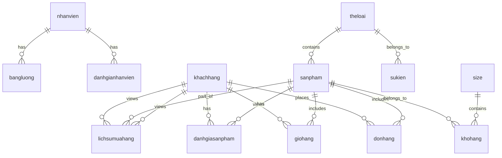

# Source Shop Website

Includes :

- Dockerfile
- docker-compose.yml
- quanlyshop.sql
- src (Source file)

# How to setup

2. Run Docker

```cmd
    docker-compose up -d
```

3. Setup database

- Go to http://localhost:8080/
- Login mysql admin ( username : root , password : example ), you can change the password in the docker-compose.yml file
- Create database "quanlyshop"
- Select "quanlyshop" database then import the file quanyshop.sql

4. Go to HomePage

- Go to http://localhost:3000/

5. Admin
   http://localhost:3100/indexadmin.php

# Database Database


/////////